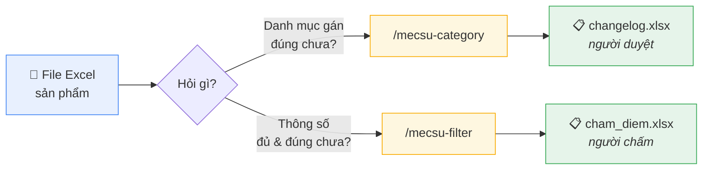
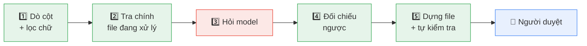
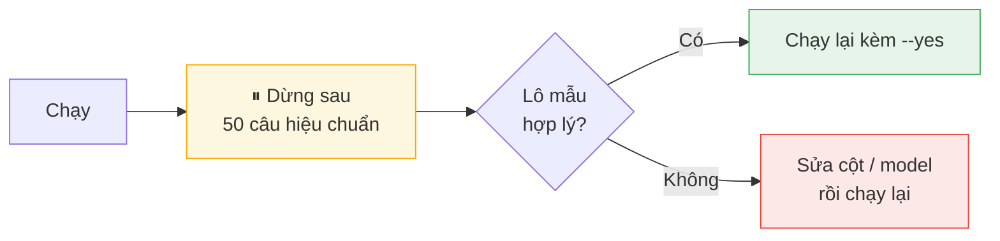

# mecsu-skills

Skill Claude Code nội bộ Mecsu cho dữ liệu sản phẩm.



## Dây chuyền — LLM là tầng cuối



🟢 **0 token** · 🔴 tốn tiền · rule lọc sạch **63.7%** dòng, phần còn lại gộp trùng **9×** trước khi gọi model

## Cài

```bash
pip install openpyxl requests python-dotenv        # Python 3.11+
```

```
/plugin marketplace add nhattrung0911/mecsu-skills
/plugin install mecsu-skills@mecsu-skills
```

```bash
cp .env.example .env      # điền MECSU_BASE_URL + MECSU_API_KEY, một lần cho mọi skill
```

## Chạy

```
/mecsu-category  d:/file.xlsx
/mecsu-filter    d:/file.xlsx
```



> ⚠️ Thoát khác 0 = **không giao**. Không phải "chạy lại kèm cờ khác cho qua".

## Đọc thêm

| | |
|---|---|
| 📘 Hướng dẫn chi tiết, bảng lỗi | [docs/huong-dan-su-dung.md](docs/huong-dan-su-dung.md) |
| ⚙️ Luật của `/mecsu-category` | [SKILL.md](skills/mecsu-category/SKILL.md) · [reference.md](skills/mecsu-category/reference.md) |
| ⚙️ Luật của `/mecsu-filter` | [SKILL.md](skills/mecsu-filter/SKILL.md) · [workflow.md](skills/mecsu-filter/workflow.md) |
| 🧪 Kiểm tra trước khi push | `claude plugin validate .` · `pytest -q` · `python tools/lint_skills.py` |
