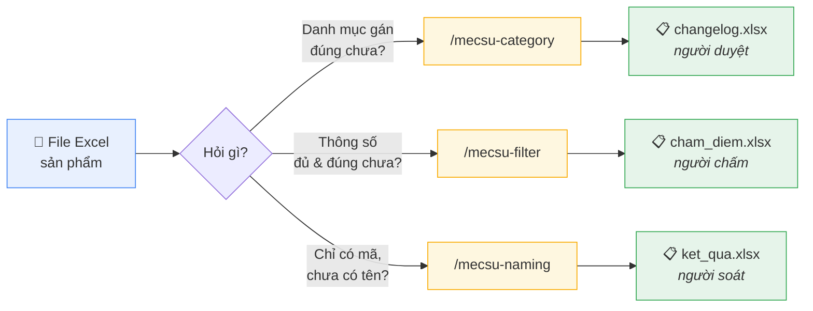
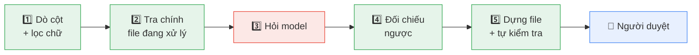
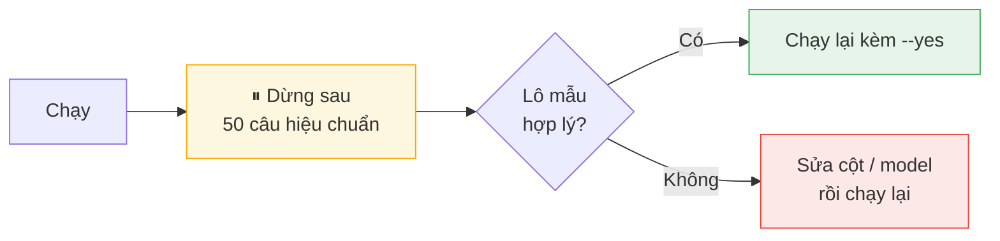

# mecsu-skills

Skill Claude Code nội bộ Mecsu cho dữ liệu sản phẩm. · **[Xem bản đồ kho trên web →](https://mecsu-skills.pages.dev)**



## Dây chuyền — LLM là tầng cuối



🟢 **0 token** · 🔴 tốn tiền · gộp trùng trước khi gọi model, và mọi giá trị model trả về đều bị
đối chiếu lại với chính nguồn — không khớp thì thành `REVIEW`, không đi vào file giao như thật.

Đo trên 100 dòng thật, 2026-09-18 — mỗi số dưới đây sinh lại được bằng một lệnh trong `tools/`:

| Skill | Số đo | Sinh lại bằng |
|---|---|---|
| `/mecsu-category` | bắt **15/15** dòng gán sai, **0** báo động giả trên 87 dòng còn nguyên | `tools/cham_cate.py` |
| `/mecsu-filter` | điền đúng **41,8%** trong 134 cặp bị xoá trắng | `tools/cham_holdout.py` |
| `/mecsu-naming` | tên để lọt tiền tố nội bộ bị hạ `REVIEW`, không giao thẳng | [test canh luật này](skills/mecsu-naming/tests/test_naming_vong2d_tien_to.py) |

## Cài

```bash
pip install openpyxl requests python-dotenv        # Python 3.11+
```

```
/plugin marketplace add nhattrung0911/mecsu-skills
/plugin install mecsu-skills@mecsu-skills
```

```bash
cp .env.example .env      # điền MECSU_BASE_URL + MECSU_API_KEY, một lần cho mọi skill
```

## Chạy

<!-- skills:run:start -->
```
/mecsu-category  d:/file.xlsx
/mecsu-filter    d:/file.xlsx
/mecsu-naming    d:/file.xlsx
```
<!-- skills:run:end -->



> ⚠️ Thoát khác 0 = **không giao**. Không phải "chạy lại kèm cờ khác cho qua".

## Skill trong kho

<!-- skills:bang:start -->
| Skill | Trả lời câu hỏi | Ra file | Luật |
|---|---|---|---|
| `/mecsu-category` | Sản phẩm này có nằm đúng danh mục lá không? | `changelog.xlsx` | [SKILL.md](skills/mecsu-category/SKILL.md) |
| `/mecsu-filter` | Sản phẩm này đã đủ và đúng thông số chưa? | `cham_diem.xlsx` | [SKILL.md](skills/mecsu-filter/SKILL.md) |
| `/mecsu-naming` | Sản phẩm chỉ có mã này tên gì, thông số bao nhiêu? | `ket_qua.xlsx` | [SKILL.md](skills/mecsu-naming/SKILL.md) |
<!-- skills:bang:end -->

Bỏ file cần xử lý vào `jobs/inbox/`. Output mỗi lần chạy nằm trong `jobs/` và **không** lên GitHub.

## Đọc thêm

| | |
|---|---|
| 🤖 Bạn là AI agent vừa clone repo này? | [AGENTS.md](AGENTS.md) |
| 📘 Hướng dẫn chi tiết, bảng lỗi thường gặp | [docs/huong-dan-su-dung.md](docs/huong-dan-su-dung.md) |
| ⚙️ Luật của từng skill | cột **Luật** ở bảng trên |
